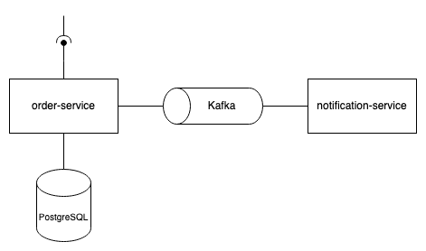

# Order Service

## Purpose of the Service
This service is a part of an example project. Its primary purpose is to a consume HTTP request to save an order. Additionally a event is published to a apache kafka topic. This implementation was created to gain insights into Kafka functionality.

## Requirements
- Docker
- Maven
- Java 
- An installed and running Apache Kafka instance. For more information visit: https://kafka.apache.org/

## Architecture
The order-service retrieves sample orders via HTTP requests and stores them in the database. Additionally, an event is published to a topic, which is then consumed by the notification-service.

## How to execute the service locally
Ensure that docker and kafka is running on your local machine.
- Execute `docker run --name order-service-db -e TZ=Europe/Berlin -e POSTGRES_USER=postgres -e POSTGRES_PASSWORD=1234 -e POSTGRES_DB=order-service-db -p 5432:5432 -d postgres` to start a docker container with a PostgreSQL database system.
- Execute the main method in the `hm.edu.order.service.Main` class from your IDE in debug mode or start the service via maven: `mvn spring-boot:run`.
